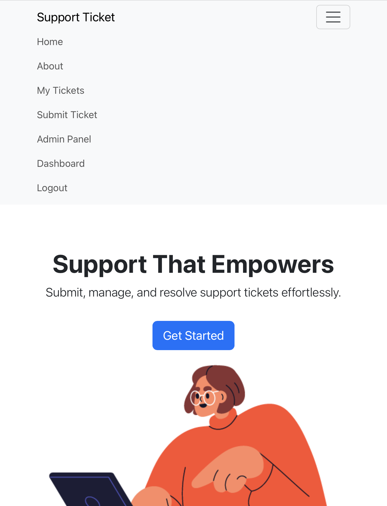

## Table of Contents

- [Project Purpose and Rationale](#project-purpose-and-rationale)
- [Target Audience](#target-audience)
- [UX / Design](#ux--design)
- [Database Schema](#database-schema)
- [Accessibility](#accessibility)
- [Features](#features)
- [Data Model Justification](#data-model-justification)
- [Relational Database](#relational-database)
- [Database Configuration Management](#database-configuration-management)
- [Technologies Used](#technologies-used)
- [Deployment](#deployment)
- [Security Considerations](#security-considerations)
- [File Structure](#file-structure-simplified)
- [Credits](#credits)
- [Future Improvements](#future-improvements)
- [TESTING.md](TESTING.md)


## IT Ticket Tracker — Milestone 3 Project

I have created  a simple full-stack web app designed to manage IT support tickets. Users can register, log in, and raise new support requests. Admins can view, edit, assign, and close tickets in real-time. The app is styled for usability, fully responsive, and built with accessibility and CRUD in mind.

---

### Live Site

**Hosted on Heroku**: [CraigAust.in](https://milestone-support-tickets-67fbfa276455.herokuapp.com)

---

## Project Purpose and Rationale

The purpose of this project is to create a simple yet powerful **IT Ticket Tracking System** that allows users to raise support requests and track their progress in real-time, while giving administrators the ability to manage, update, and respond to these tickets efficiently. 

The system addresses a real-world need: many small to medium-sized businesses and organizations lack a lightweight, affordable solution for internal IT support management. This project offers a streamlined tool to improve communication, accountability, and service speed between users and support teams.

---

## Target Audience

- **Internal Employees** who need to report technical issues and monitor ticket progress.
- **IT Support Staff and Administrators** who need a centralized place to manage incoming support requests and maintain an activity log for transparency.

The system is designed to be intuitive for non-technical users while offering advanced management features for administrators.

---

## Data Structure

The application uses a well-designed relational database with three main tables:

- **User Table**: Stores user credentials and roles (admin or regular user).
- **Ticket Table**: Stores support ticket details, linked to the submitting user.
- **Activity Log Table**: Tracks all updates and actions taken on each ticket for transparency.

This structure supports full CRUD operations, maintains a clear audit trail, and allows for future expansion such as adding ticket priorities, assignments, and threaded discussions.

---

## Security Features

Security was a core consideration in development:

- **Authentication and Authorization**: Only registered users can create or manage tickets. Admin routes are protected with access control decorators.
- **Password Security**: Passwords are hashed using bcrypt before being stored in the database.
- **Environment Variables**: All sensitive keys (database URIs, API keys, secret keys) are securely managed through environment variables.
- **CSRF Protection**: Flask-WTF is used to automatically protect all forms against CSRF attacks.
- **Role-Based Access Control**: Users can only access and edit their own tickets; admins can view and manage all tickets.
- **Data Validation**: All form inputs are validated both client-side and server-side to prevent malicious input.

Together, these measures ensure that user data is protected, interactions are secure, and the platform can be trusted by its users.

---

## Project Overview


The goal was to build a fully functional **full-stack application** with a real-world use case. I chose to build an **IT Support Ticket Tracker**, a tool that could be used by companies to log internal technical issues, assign support staff, and track the status of tickets.  This is something missing at my current workplace and this is what inspired me to do the project.

---

## Target Audience

- Small to mid-sized companies with internal IT teams.
- Admins managing IT support workloads.
- End users needing to report problems/ get help/ help their business grow.  This allows them to also track responses from the admins.

---

##  UX / Design

###  Wireframes
All wireframes were created using adobe illustrator and can be found 


###  Key UX Goals
- Minimal, clean layout for both users and admins.
- Clear call-to-actions for creating and updating tickets.
- Responsive design across mobile, tablet, and desktop.





## Database Schema

The application uses SQLAlchemy ORM to manage a relational database. It includes three primary models:

- **User**: Stores login credentials, roles, and links to submitted tickets.
- **Ticket**: Represents a support request created by a user.
- **Status**: Tracks the current state of each ticket (e.g. Submitted, In Progress, Done).

### Rationale & Design Considerations

The schema was designed based on real-world user stories. Regular users need to raise support tickets and track progress by logging in. Admins require access to all tickets, along with the ability to update statuses and manage workload. By separating ticket `Status` into its own table, the design allows for future scalability, including analytics, filters, and workflow automation.

The database schema supports full Create, Read, Update, and Delete operations using SQLAlchemy. Field types have been chosen for flexibility and performance (e.g., `Text` for descriptions, `DateTime` for timestamps). This structure also allows for future enhancements like assigning tickets to support staff or adding threaded comments.


### Entity Relationships

 [Entity Relationships Diagram](static/images/EntityRelationships.png)

 
 
### Visual ERD

 [Database Schema](static/images/database_schema.png)

---

## User Stories

Below are the user stories that guided the development of this full stack web application:

1. **Account Creation and Login**  
   As a new user, I want to register for an account and securely log in, so that I can access the full features of the application and manage my own data.

2. **CRUD Functionality**  
   As a logged-in user, I want to create, view, update, and delete support tickets, so that I can manage my submissions efficiently.

3. **Real-Time Feedback and Validation**  
   As a user filling out forms, I want to see immediate feedback for errors or confirmations, so that I know my actions are being processed correctly.

4. **Responsive and Accessible Design**  
   As a mobile or screen reader user, I want to navigate the application easily, so that I can interact with the site regardless of my device or ability.

5. **Admin-Level Access**  
   As an admin, I want to manage user roles and oversee records, so that I can ensure the system runs smoothly and securely.

6. **Data Persistence**  
   As a user, I want to have my submitted data stored securely in a database, so that I can retrieve or update it later.

7. **Error and Success Notifications**  
   As a user, I want to receive clear messages when an action succeeds or fails, so that I know what happened and what to do next.

8. **Deployment Access**  
   As a user, I want to access the application online without installing anything, so that I can use it from any device.
 ---

## Accessibility

Accessibility was a core consideration throughout the design and development of this project to ensure that it is usable by as many people as possible, including users with disabilities.

The following steps were taken to improve accessibility:

- **Semantic HTML:** All pages use semantic HTML5 elements (e.g., `<header>`, `<main>`, `<nav>`, `<section>`, `<footer>`) to ensure content is structured logically for screen readers and assistive technologies.


  
- **ARIA Labels:** ARIA (Accessible Rich Internet Applications) attributes were added to key interactive elements where additional context was needed, improving the navigation experience for users relying on screen readers.

  


- **Keyboard Navigation:**
  - All interactive elements (buttons, links, forms) are fully accessible via keyboard alone.
  - Focus indicators (`:focus-visible`) are clearly visible, helping users understand where they are on the page.
  
  
- **CSS for Accessibility:**
  - Accessible `line-height` and `text-wrap` properties have been applied for better readability.
  - Form controls inherit fonts correctly to maintain consistency across different devices and user settings.
  - Media elements (images, videos, etc.) have responsive defaults and are styled to avoid overflow issues.

- **Alt Text for Images:** All images include appropriate `alt` text to describe content where necessary.

- **Color Contrast:** I made a conscious effort to ensure good color contrast between background and foreground elements, adhering to WCAG 2.1 guidelines wherever possible.

- **Responsive Design:**
  - The layout adapts effectively across screen sizes.
  - Text size and element spacing are designed to remain legible without requiring zoom.

- **Accessability via browsers:**


- For Chrome devtools accessability tests goto [TESTING.md](TESTING.md)

This ensures that the application is inclusive and provides a usable experience for a wider audience.

## Features

### MVP Features
- User registration and login/logout (Flask & SQLAlchemy)
- Raise a new IT support ticket
- View ticket details
- Edit/update ticket status (admin only)
- Delete ticket (admin only)
- Responsive layout (Bootstrap + custom CSS)

### User Roles
- **Regular Users**: Can log in and create/view their own tickets.
- **Admins**: Can view all tickets, assign users, change statuses, and delete tickets.

## Data Model Justification

- The data model was designed to reflect real-world technical support workflows. Users can submit tickets and view updates, while admins can update statuses and add notes. Each update is stored in a log to ensure transparency and accountability.

- A User can submit multiple Tickets.
- A Ticket tracks its status, description, and is linked to a User.
- All ticket updates (like status changes, admin responses) are stored in ActivityLogs.
- This structure ensures full CRUD capability, supports real-time feedback, and provides a scalable foundation for future features (e.g., ticket assignment, priority levels, threaded comments).

 [Database Schema](static/images/database_schema.png)

## Relational Database

The data model was developed into a fully relational database using **SQLAlchemy ORM** with **PostgreSQL** as the production database and **SQLite** for local development.

### Technologies Used
- **SQLAlchemy**: Object Relational Mapper (ORM) to handle database models and operations.
- **SQLite**: Lightweight relational database used during local development.
- **PostgreSQL**: Production-grade relational database used on Heroku.
- **Flask-SQLAlchemy**: Flask extension that integrates SQLAlchemy smoothly with the Flask application.

### Database Setup and Configuration
- In local development, the database defaults to SQLite (`sqlite:///instance/support_db.db`).
- In production (deployed on Heroku), environment variables configure a PostgreSQL database connection securely using `psycopg2-binary`.
- `python-dotenv` is used to manage sensitive credentials (e.g., database URLs) via a `.env` file during local development.

### Table Structure
The database contains three primary tables:

- **User Table**: Stores user authentication details and roles (admin/user).
- **Ticket Table**: Stores ticket submissions, categories, status, and user references.
- **ActivityLog Table**: Stores action logs related to ticket updates and user activity.

Each table was designed to:
- Ensure **data integrity** through primary keys and foreign keys.
- Support **1-to-many relationships** (e.g., a user can have multiple tickets).
- Allow **consistent and structured data storage**.
- Provide **full CRUD (Create, Read, Update, Delete)** operations with minimal redundancy.

### Data Consistency and Organisation
- Fields use appropriate data types (e.g., `String`, `Text`, `DateTime`).
- Default values are used where applicable (e.g., `created_at` timestamps).
- Relationships are clearly defined to maintain data consistency (e.g., ticket status linked to users and tickets).
- Cascading rules (e.g., `delete-orphan`) are used in relationships to maintain referential integrity.

### Scalability Considerations
The database was structured to allow for future expansion, including:
- Ticket assignment to staff members.
- Ticket prioritisation and categorisation.
- Additional activity types in the `ActivityLog`.
- User role management (admin vs. regular users).

[Database](static/images/database.png)

## Database Configuration Management

All database configuration settings are maintained in a single `config.py` file. The application dynamically loads the database URI and related credentials from environment variables, ensuring no hardcoded values are present and allowing easy switching between local (SQLite) and production (PostgreSQL) databases.


### Manual Tests
- Form validation for all inputs (ticket submission, login, etc.)
- Role-based access controls
- Navigation via keyboard (Tab, Shift+Tab)
- Screen reader check using VoiceOver (Mac)
- Responsive layout on different screen sizes

### Automated Tests
- Lighthouse Accessibility audit (Chrome DevTools)  
  - Score: 97/100
- WAVE accessibility checker
- PEP8 validation using flake8
- HTML validation with W3C validator

### Bugs & Fixes
-  **Issue**: Tickets could be submitted without a subject line.  
   **Fix**: Added Flask-WTF form validation with required fields.
-  **Issue**: Admin-only routes were accessible without login.  
   **Fix**: Added `@login_required` and role-based checks.
-  **Issue**:Mailgun API's were pushed to github because of bad formatting in the gitignore  
   **Fix**: quickly replaced the API's
   **Todo**: Remove any old API's from github

- All other known bugs have been addressed.

**Go to TESTING →** [TESTING.md](TESTING.md)
---

## Technologies Used

### Back End
- Python  
- Flask  
- Jinja2 (template engine)  
- SQLAlchemy  
- Flask-WTF (form validation)  
- Flask-Mail (email functionality)  
- SQLite (dev), MySQL (production)  
- dotenv (for managing environment variables)  
- PEP8 via flake8  
- Code formatting with Black
- Routes
- gunicorn
**For all requirements go to →** [Requirements](requirements.txt)


### Front End

- Bootstrap
- HTML/CSS

###  Other Tools
- Heroku (deployment)
- GitHub (version control)
- Mailgun (for email confirmations)

 
### Configuration

All sensitive settings are stored in environment variables and loaded through a central `config.py` file using Python's `os.getenv()` and `python-dotenv`.

This ensures secure, flexible, and environment-specific configuration for both development and production environments.


### PEP8 Compliance

Code quality and style were maintained throughout the project using two industry-standard tools: **Flake8** and **Black**.

- **Linting** was performed using `flake8`, with a configuration file (`.flake8`) specifying the following:
  - `exclude = venv` – to ignore third-party packages and focus only on project code.
  - `max-line-length = 102` – slightly extended from the PEP8 default to accommodate readable lines without unnecessary wrapping but still left my code readable.
- All Python files were scanned and verified to be compliant with [PEP8](https://peps.python.org/pep-0008/) standards, including rules for:
  - Spacing and indentation  
  - Function and variable naming conventions  
  - Import ordering and blank lines  
  - Docstring usage
- Any `E501` warnings for long lines within the `venv/` directory were ignored as they do not pertain to the submitted codebase.
- All remaining issues within the project files (`app.py`, `routes.py`, etc.) were resolved, with no critical errors after final linting.
- **Black** was used to automatically format all Python code, ensuring consistent spacing, quoting, and line wrapping.


- [Black Formatter](static/images/black_formatter.png)  
- [Flake8 Formatted](static/images/black8a.png)  
- [Flake8 Pass](static/images/black8b.png)


#### Environment Variables Used:

- `SECRET_KEY` – Flask app security
- `DATABASE_URL` – PostgreSQL URL from Heroku (fallbacks to SQLite locally)
- `FLASK_ENV` – Toggles debug mode (`production` disables it)
- `MAILGUN_API_KEY`, `MAILGUN_DOMAIN`, `MAILGUN_SENDER`, `MAILGUN_WEBHOOK_SECRET`, `MAILGUN_PUBLIC_KEY` – Used for Mailgun email integration

#### Key Features in `config.py`:

- Single point of truth for all configuration settings
- Loads `.env` file locally for development using `python-dotenv`
- Automatically fixes Heroku's `postgres://` to `postgresql://`
- Disables `DEBUG` mode automatically in production


## Deployment

The application is deployed to **Heroku** using the following process:

1. **To run this project locally after pulling the repo:**
   - In VS Code terminal, Create a virtual environment:

   - macOS/Linux:
   python3 -m venv venv
   source venv/bin/activate
   - Windows:
   python -m venv venv
   venv\Scripts\activate

   - Install dependencies:
   pip install -r requirements.txt
   - Run the app: Make sure you are in the apps directory
   - In terminal type  'source venv/bin/activate' to activate the env.  Now type ' python run.py;'
   you should now see somthing like this and your application will be live on this port.
   - [Flake8 Pass](static/images/environment.png)


2. **Set Up the Heroku App**
   - Created a new application on the Heroku dashboard.
   - Provisioned a **Heroku Postgres** database addon.
   - Configured environment variables (`DATABASE_URL`, `SECRET_KEY`, `MAILGUN_API_KEY`, etc.) using the **Settings > Config Vars** section.

3. **Connect to GitHub**
   - Linked the GitHub repository to the Heroku app.
   - Enabled **automatic deployment** from the `main` branch.
   - Manually deployed the initial version to verify setup.

4. **Database Migration**
   - Opened the Heroku console and ran database migrations (e.g., `flask shell` -> `db.create_all()`).
   - Verified tables were created successfully.

5. **Post-Deployment Testing**
   - Visited the deployed URL to verify that all functionality matched the local development version.
   - Checked user authentication, ticket submission, admin dashboard access, and email notifications.


---

## Security Considerations

- All sensitive information (such as secret keys, API keys, database credentials) is securely stored as environment variables.
- No working credentials are ever committed to the GitHub repository.
- Admin-only features are protected using decorators (`@login_required`, `@admin_required`).
- Passwords are hashed using **bcrypt** and have a minimum required length of 8 characters.
- CSRF protection is enabled automatically via Flask-WTF for all forms.
- Regular updates and monitoring of package dependencies are planned to mitigate vulnerabilities.

---

##  File Structure (simplified)
```
milestone-project-three/

│
├── app.py
├── config.py
├── routes.py
├── run.py
├── requirements.txt
├── Procfile
├── README.md
├── TESTING.md
├── templates/
├── static/
│   ├── styles.css
│   └── images/
│      
├── instance/
│   └── (database or environment-related files)
├── venv/
├── .env (in .gitignore)
└── .vscode/

```
## Credits

- Design inspiration from various helpdesk UIs that I found on google.
- Some Bootstrap snippets sourced from [getbootstrap.com](https://getbootstrap.com).
- Accessibility tested with [WAVE](https://wave.webaim.org/) and Chrome Lighthouse.
- CSS reset [Josh Comeau](https://www.joshwcomeau.com/css/custom-css-reset/).
- Envato for my graphics [Evato](https://www.envato).
- Help from W3 schools [W3 Schools]( http://w3schools.com/). 
- https://www.udemy.com/course/python-flask-beginners/.
- https://www.youtube.com/watch?v=G1FBSYJ45Ww
---

## Future Improvements

- Assign tickets to specific support staff
- Add comments to each ticket
- Implement search and filters for tickets
- Add automated email notifications on ticket 
