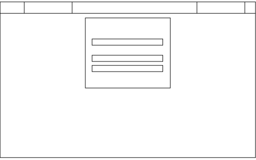

## IT Ticket Tracker — Milestone 3 Project

I have created  a simple full-stack web app designed to manage IT support tickets. Users can register, log in, and raise new support requests. Admins can view, edit, assign, and close tickets in real-time. The app is styled for usability, fully responsive, and built with accessibility and CRUD in mind.

---

### Live Site

**Hosted on Heroku**: [CraigAust.in](https://milestone-support-tickets-67fbfa276455.herokuapp.com)

---

## Project Overview


The goal was to build a fully functional **full-stack application** with a real-world use case. I chose to build an **IT Support Ticket Tracker**, a tool that could be used by companies to log internal technical issues, assign support staff, and track the status of tickets.  This is something missing at my current workplace and this is what inspired me to do the project.

---

## Target Audience

- Small to mid-sized companies with internal IT teams.
- Admins managing IT support workloads.
- End users needing to report problems/ get help/ help their business grow.  This allows them to also track responses from the admins.

---

##  UX / Design

###  Wireframes
All wireframes were created using adobe illustrator and can be found 




###  Key UX Goals
- Minimal, clean layout for both users and admins.
- Clear call-to-actions for creating and updating tickets.
- Responsive design across mobile, tablet, and desktop.


---

## Features

### MVP Features
- User registration and login/logout (Flask & SQLAlchemy)
- Raise a new IT support ticket
- View ticket details
- Edit/update ticket status (admin only)
- Delete ticket (admin only)
- Responsive layout (Bootstrap + custom CSS)

### User Roles
- **Regular Users**: Can log in and create/view their own tickets.
- **Admins**: Can view all tickets, assign users, change statuses, and delete tickets.

---

## Testing

Testing was a mix of **manual** and **automated** methods:

### Manual Tests
- Form validation for all inputs (ticket submission, login, etc.)
- Role-based access controls
- Navigation via keyboard (Tab, Shift+Tab)
- Screen reader check using VoiceOver (Mac)
- Responsive layout on different screen sizes

### Automated Tests
- Lighthouse Accessibility audit (Chrome DevTools)  
  - Score: 97/100
- WAVE accessibility checker
- PEP8 validation using flake8
- HTML validation with W3C validator

### Bugs & Fixes
-  **Issue**: Tickets could be submitted without a subject line.  
   **Fix**: Added Flask-WTF form validation with required fields.
-  **Issue**: Admin-only routes were accessible without login.  
   **Fix**: Added `@login_required` and role-based checks.
-  **Issue**:Mailgun API's were pushed to github because of bad formatting in the gitignore  
   **Fix**: quickly replaced the API's
   **Todo**: Remove any old API's from github

- All other known bugs have been addressed.

**Go to TESTING →** [TESTING.md](TESTING.md)
---

## Technologies Used

### Back End
- Python  
- Flask  
- Jinja2 (template engine)  
- SQLAlchemy  
- Flask-WTF (form validation)  
- Flask-Mail (email functionality)  
- SQLite (dev), MySQL (production)  
- dotenv (for managing environment variables)  
- PEP8 via flake8  
- Code formatting with Black
- Routes
- gunicorn
**For all requirements go to →** [Requirements](requirements.txt)


### Front End

- Bootstrap
- HTML/CSS

###  Other Tools
- Heroku (deployment)
- GitHub (version control)
- Mailgun (for email confirmations)

---

## Deployment

Deployed via **Heroku** using the following process:

1. Set up PostgreSQL database on Heroku
2. Configure `Procfile`, `requirements.txt`, `runtime.txt`
3. Set environment variables using Heroku dashboard
4. Pushed code via GitHub → connected Heroku app
5. Verified deployed version matches development version

**For all go to →** [Deployment](static/images/deploy.png)

---

##  Security Considerations

- All secret keys and credentials are stored as environment variables.
- No working API keys or passwords are committed to the repo.
- Admin-only routes are protected via decorators.
- CSRF protection is enabled on all forms.
- Minimum 8 characters for the password.


---

##  File Structure (simplified)

```
milestone-project-three/

│
├── app.py
├── config.py
├── routes.py
├── run.py
├── requirements.txt
├── Procfile
├── README.md
├── TESTING.md
├── templates/
├── static/
│   ├── styles.css
│   └── images/
│      
├── instance/
│   └── (database or environment-related files)
├── venv/
├── .env (in .gitignore)
└── .vscode/

```

---

## Credits

- Design inspiration from various helpdesk UIs that I found on google.
- Some Bootstrap snippets sourced from [getbootstrap.com](https://getbootstrap.com).
- Accessibility tested with [WAVE](https://wave.webaim.org/) and Chrome Lighthouse.
- CSS reset [Josh Comeau](https://www.joshwcomeau.com/css/custom-css-reset/).
- Envato for my graphics [Evato](https://www.envato).
- Help from W3 schools [W3 Schools]( http://w3schools.com/). 
- https://www.udemy.com/course/python-flask-beginners/.
- https://www.youtube.com/watch?v=G1FBSYJ45Ww
---

## Future Improvements

- Assign tickets to specific support staff
- Add comments to each ticket
- Implement search and filters for tickets
- Add automated email notifications on ticket 
