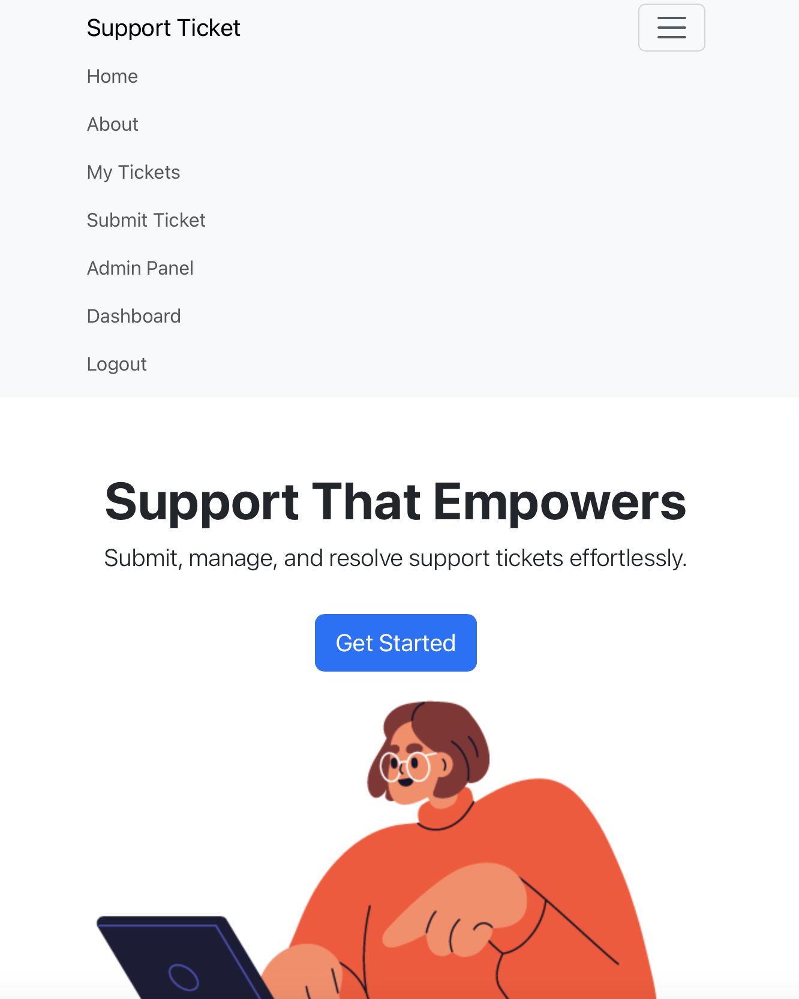

# TESTING.md – Craig Aust.in Support Ticket System

This document outlines accessibility, manual testing, device/browser testing, known bugs, and suggestions for the CraigAust.in Support Ticket System.

---

## Accessibility Testing

| Tool                        | Result |
|-----------------------------|--------|
| [WAVE](https://wave.webaim.org/)           | ✅ Pass |
| Chrome Lighthouse (97/100) | ✅ Pass |

---

## Manual Testing (Full Detail)

### User Authentication

| Feature                        | Expected Result                         | Actual Result                          | Status |
|--------------------------------|------------------------------------------|-----------------------------------------|--------|
| Register with valid credentials | Account created, redirected to dashboard | ✅ As expected                          | ✅ Pass |
| Login with valid user          | Logged in and redirected                 | ✅ As expected                          | ✅ Pass |
| Login with invalid credentials | Error message shown                      | ✅ As expected                          | ✅ Pass |
| Logout                         | User redirected to login screen          | ✅ As expected                          | ✅ Pass |

###  Ticket Functionality

| Feature                        | Expected Result                                | Actual Result                        | Status |
|--------------------------------|-------------------------------------------------|---------------------------------------|--------|
| Submit ticket as user          | Ticket saved, appears in "My Tickets"          | ✅ As expected                        | ✅ Pass |
| Admin views all tickets        | Admin dashboard shows all user submissions     | ✅ As expected                        | ✅ Pass |
| Update ticket status (admin)   | Ticket status changes in list                  | ✅ As expected                        | ✅ Pass |

### Navigation & Responsiveness

| Feature                        | Expected Result                                | Actual Result                        | Status |
|--------------------------------|-------------------------------------------------|---------------------------------------|--------|
| Navbar links                   | All links work and reflect login state         | ✅ As expected                        | ✅ Pass |
| Flash messages                 | Flash appears on login/logout/submit           | ✅ As expected                        | ✅ Pass |
| Mobile responsiveness          | Layout adjusts cleanly on small screens        | ✅ As expected                        | ✅ Pass |
| Contrast on backgrounds        | Inputs and placeholders readable               | ✅ As expected                        | ✅ Pass |

---

## Browser & Device Testing

Tested on the following:

- ✅ Chrome (Windows & macOS)
- ✅ Firefox
- ✅ Safari (macOS & iPhone)
- ✅ Edge (Windows)
- ✅ iPhone 13 (iOS Safari)

All layouts, forms, and features functioned as expected.

---

## Known Bugs & Fixes

| Issue                             | Resolution                                                   | Status |
|----------------------------------|--------------------------------------------------------------|--------|
| Mailgun API exposed in repo      | Replaced keys, updated `.env`, added `.env.example`          | ✅ Fixed |
| Account temporarily blocked      | Contacted Mailgun and reissued credentials                   | ⚠️ Workaround applied |

---

## Automated Testing

- Lighthouse audit (Chrome): Score 97/100
- WAVE accessibility checker: Passed
- `flake8`: Used for Python style validation (PEP8)
- W3C HTML Validator: All pages passed with no critical errors

---

## 💡 Suggestions for Future Improvements

- Add password reset via email (Mailgun integration)
- Full mail template setup for branded notifications
- Add threaded ticket comments (user <-> admin communication)

---

[← Back to README](README.md)