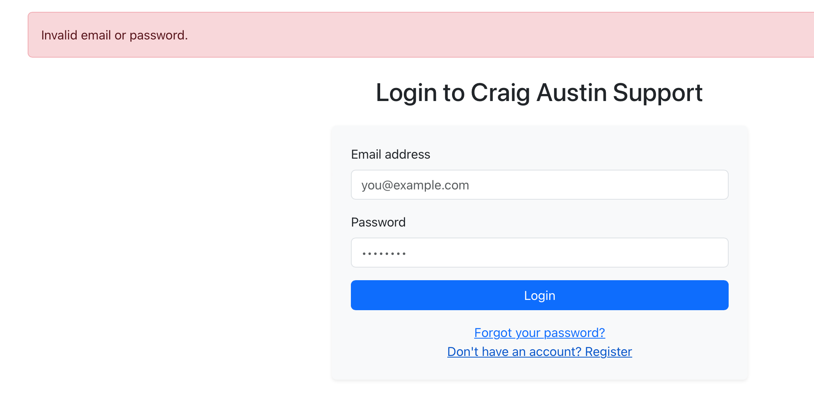
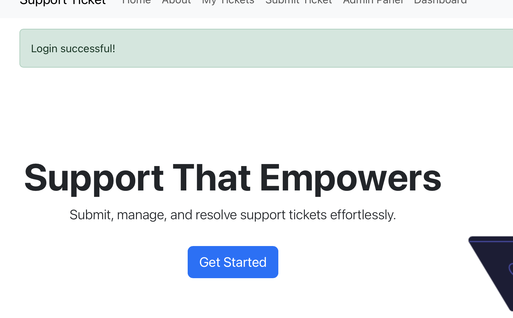

# TESTING.md – Craig Aust.in Support Ticket System

This document outlines manual testing, device/browser testing, known bugs, and suggestions for the CraigAust.in Support Ticket System.

---

## Assesabilty Testing 

| Test | Result |
|------|--------|
| Tested with wave.webaim.org | ✅ Pass |
| Tested with Chrome Lighthouse | ✅ Pass |

https://wave.webaim.org/report#/https://milestone-support-tickets-67fbfa276455.herokuapp.com

## Manual Testing Summary

### User Authentication
| Test | Result |
|------|--------|
| Register with valid credentials | ✅ Pass |
| Login with valid user | ✅ Pass |
| Login with invalid user | ✅ Fail message shown |
| Logout | ✅ Pass |

### Ticket Functionality
| Test | Result |
|------|--------|
| Submit a ticket as a logged-in user | ✅ Pass |
| View my tickets list | ✅ Pass |
| Admin can view all tickets | ✅ Pass |
| Admin can update ticket status | ✅ Pass |

### Navigation and Responsiveness
| Test | Result |
|------|--------|
| Navbar links work | ✅ Pass |
| Flash messages appear | ✅ Pass |
| Layout adjusts on mobile/tablet | ✅ Pass |
| Placeholder text visible on coloured backgrounds | ✅ Pass |

---

## Browser and Device Testing

Tested on the following:
- Chrome (Windows & macOS)
- Firefox
- Safari (macOS & iPhone)
- Edge (Windows)
- iPhone 13 (iOS Safari)

No issues found with layout or functionality.

---

## Known Bugs
| Issue     | Status |
|-----------|--------|
| MailGun   | Account Blocked because the .env was pushed to github despite being on the .gitignore |

---

## Suggestions for Future Improvements
- Password reset functionality with an email from Mailgun
- Full mail template setup to match the sites branding
- A section where admin and the user can comment if more details are needed

---

**Back to main README →** [README.md](README.md)

