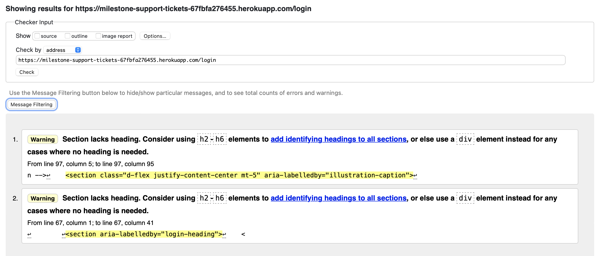
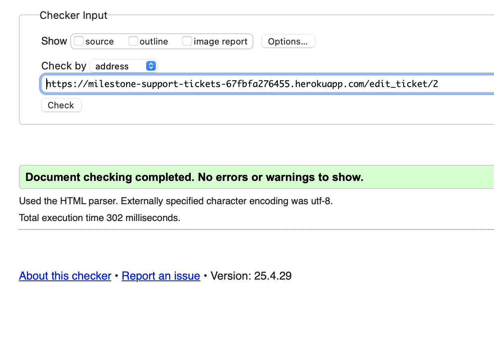
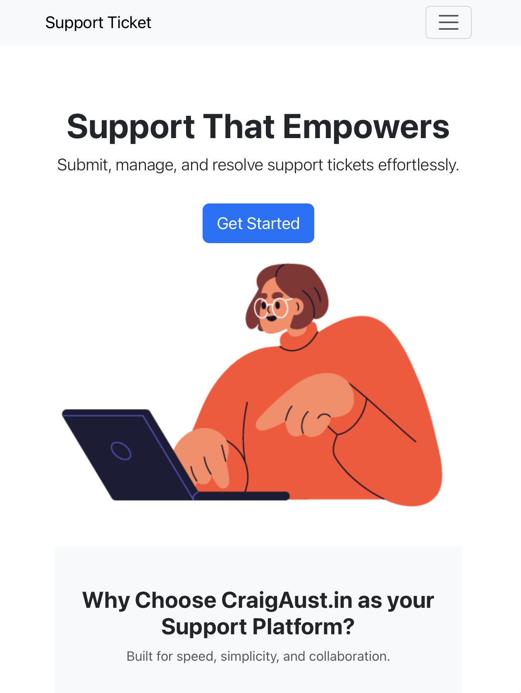

## Table of Contents

- [Accessibility Testing](#accessibility-testing)
- [Manual Testing (Full Detail)](#manual-testing-full-detail)
  - [User Authentication](#user-authentication)
  - [Ticket Functionality](#ticket-functionality)
  - [Navigation & Responsiveness](#navigation--responsiveness)
- [Browser & Device Testing](#browser--device-testing)
- [Known Bugs & Fixes](#known-bugs--fixes)
- [Automated Testing](#automated-testing)
- [💡 Suggestions for Future Improvements](#-suggestions-for-future-improvements)

# TESTING.md – Craig Aust.in Support Ticket System

This document outlines accessibility, manual testing, device/browser testing, known bugs, and suggestions for the CraigAust.in Support Ticket System.

---

## Accessibility Testing

| Tool                        | Result |
|-----------------------------|--------|
| [WAVE](https://wave.webaim.org/)     | ✅ Pass |
| Chrome Lighthouse (97/100) | ✅ Pass |

- W3 Schools Validator

- W3 Schools Validator - FAIL

- W3 Schools Validator - FAIL

---

## Manual Testing (Full Detail)

### User Authentication

| Feature                        | Expected Result                         | Actual Result                          | Status |
|--------------------------------|------------------------------------------|-----------------------------------------|--------|
| Register with valid credentials | Account created, redirected to dashboard | ✅ As expected                          | ✅ Pass |
| Login with valid user          | Logged in and redirected                 | ✅ As expected                          | ✅ Pass |
| Login with invalid credentials | Error message shown                      | ✅ As expected                          | ✅ Pass |
| Logout                         | User redirected to login screen          | ✅ As expected                          | ✅ Pass |

###  Ticket Functionality

| Feature                    | Expected Result                            | Actual Result      | Status     |
|----------------------------|---------------------------------------------|--------------------|------------|
| Submit ticket as user      | Ticket saved, appears in "My Tickets"       | ✅ As expected      | ✅ Pass     |
| Admin views all tickets    | Admin dashboard shows all user submissions | ✅ As expected      | ✅ Pass     |
| Update ticket category     | Ticket category updated successfully        | ✅ As expected      | ✅ Pass     |
| Update ticket status       | Ticket status changes in list               | ✅ As expected      | ✅ Pass     |
| Delete ticket (admin)      | Ticket removed from system                  | ✅ As expected      | ✅ Pass     |
| Confirm delete prompt      | User sees confirmation message              | ✅ As expected      | ✅ Pass     |
| Non-admin views only own   | Regular users cannot see others’ tickets    | ✅ As expected      | ✅ Pass     |
| Admin dashboard restricted | Only admins can access admin dashboard      | ✅ As expected      | ✅ Pass     |
| Pagination on ticket list  | Multiple pages shown if ticket list is long | ✅ As expected      | ✅ Pass     |

### Navigation & Responsiveness

| Feature                        | Expected Result                                | Actual Result                        | Status |
|--------------------------------|-------------------------------------------------|---------------------------------------|--------|
| Navbar links                   | All links work and reflect login state         | ✅ As expected                        | ✅ Pass |
| Flash messages                 | Flash appears on login/logout/submit           | ✅ As expected                        | ✅ Pass |
| Mobile responsiveness          | Layout adjusts cleanly on small screens        | ✅ As expected                        | ✅ Pass |
| Contrast on backgrounds        | Inputs and placeholders readable               | ✅ As expected                        | ✅ Pass |

---

## Browser & Device Testing

Tested on the following:

- ✅ Chrome (Windows & macOS)
- ✅ Firefox
- ✅ Safari (macOS & iPhone)
- ✅ Edge (Windows)
- ✅ iPhone 13 (iOS Safari)

All layouts, forms, and features functioned as expected.

---

## Known Bugs & Fixes

| Issue                             | Resolution                                                   | Status |
|----------------------------------|--------------------------------------------------------------|--------|
| Mailgun API exposed in repo      | Replaced keys, updated `.env`, added `.env.example`          | ✅ Fixed |
| Account temporarily blocked      | Contacted Mailgun and reissued credentials                   | ⚠️ Workaround applied |

---

## Automated Testing

- Lighthouse audit (Chrome): Score 97/100
- WAVE accessibility checker: Passed
- `flake8`: Used for Python style validation (PEP8)
- W3C HTML Validator: All pages passed with no critical errors

---

## 💡 Suggestions for Future Improvements

- Add password reset via email (Mailgun integration)
- Full mail template setup for branded notifications
- Add threaded ticket comments (user <-> admin communication)

---

[← Back to README](README.md)